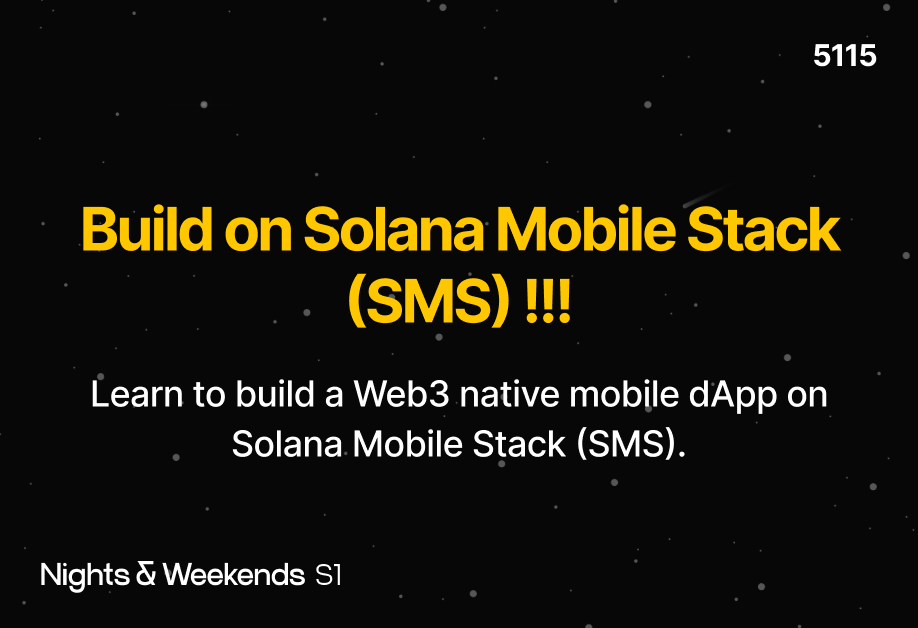
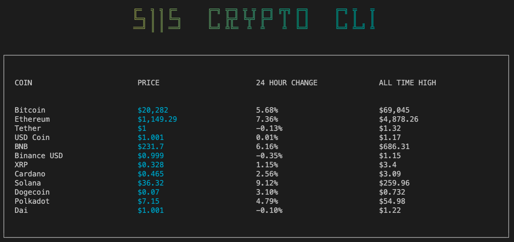

import Bleed from 'nextra-theme-docs/bleed'

# 5115

Have you ever wondered, How to build on Solana Mobile Stack (SMS) !!!

You've come to the right place ...Learn to build a Web3 native mobile dApp on Solana Mobile Stack (SMS).

*sidebar: my intent is share What I am learning; How I am learning with you ...so as to help you with your Web3 journey.*

<Bleed></Bleed>

A good starting point is to build a simple **Command Line Interface (CLI)** app, and by doing so, you'll learn:

```
- What is a CLI app
- How to build a CLI app using React and Ink
- What is CoinGecko
- How to access its API
- How to use Axios to fetch your own data from CoinGecko
- Have a working CLI app and pulls in-realtime data from the Web3 market
- How to get off localhost and ship a working product
- Keep up the momentum and enjoy the journey
```

<Bleed></Bleed>
